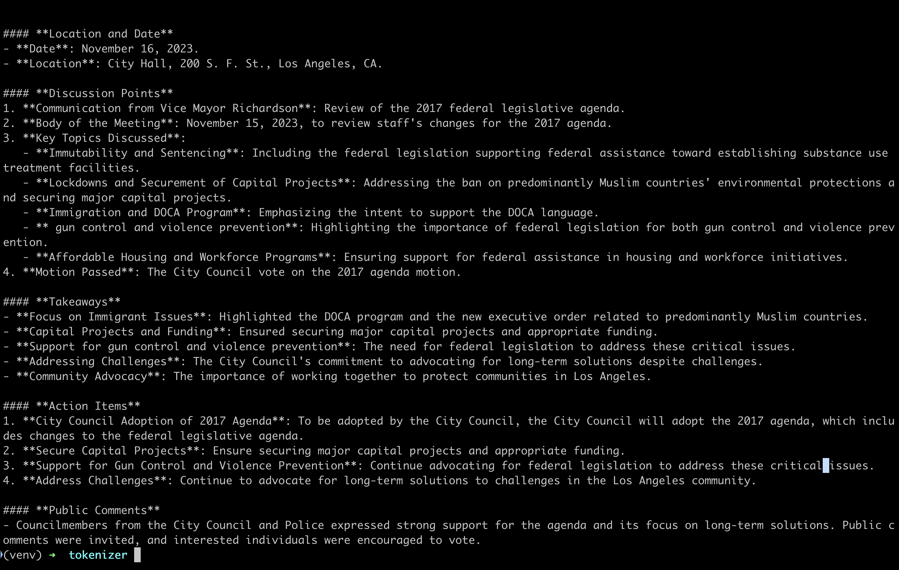

# Meeting Minutes Generator

This is an example project that takes a meeting transcript and generates a summary (meeting minutes). It utilizes a local model from Hugging Face with the `transformers` dependency. The selected model is `Deepseek R1`, running locally on a CPU. The input transcript is tokenized before processing.

## Installation & Setup

### 1. Prepare the Environment

1. Create a `.env` file in the project root with the following content:

    ```ini
    HF_TOKEN=your-hugging-face-token
    TRANSCRIPT_FILE_NAME=transcript_example.txt
    ```

2. Place the transcript file (`transcript_example.txt`) inside the `assets` folder.

### 2. Setup Virtual Environment

Run the following commands:

```bash
python3 -m venv venv
source venv/bin/activate  # On macOS/Linux
venv\Scripts\activate  # On Windows
```

### 3. Install Dependencies

```bash
pip3 install -r requirements.txt
```

### 4. Run the Application

```bash
python3 main.py
```

The generated meeting minutes will be printed on the screen.

## Screenshot



## Code Design

To structure the code efficiently, a **pipeline pattern** was quickly implemented. This allows better organization and modularity, making it easier to extend or modify in the future.

## Running on GPU (Optional)

If executing on a GPU, it is recommended to apply quantization for optimized performance. An example configuration using **BitsAndBytesConfig** is provided below:

```python
from transformers import AutoModelForCausalLM, BitsAndBytesConfig

quant_config = BitsAndBytesConfig(
    load_in_4bit=True,
    bnb_4bit_use_double_quant=True,  # Double quantization (32b -> 8b -> 4b)
    bnb_4bit_compute_dtype=torch.bfloat16,
    bnb_4bit_quant_type="nf4"  # Normalized Floating Point 4-bit
)

model = AutoModelForCausalLM.from_pretrained(
    DEEP_SEEK_R1_DISTILL,
    trust_remote_code=True,
    device_map="auto",
    quantization_config=quant_config,
)
```

This reduces memory usage and speeds up inference while maintaining accuracy.

